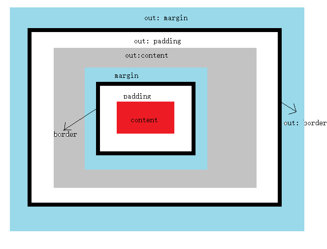

**分别什么情况下输出null undefined 和空？？？**

输出**undefined**:前边var a;没赋值，后边就直接使用

输出错误，**not denfine**: 这个变量使用前没被定义（注意包括变量提升）

输出**null**:

字符串和数组的方法：[E:\webWorkspace\02_JSStudy\09day]()

forEach：数组

for(in)：对象


## 数据类型/6+3

基本数据类型：number string boolean null undefined symbol <span style="color:red">（6种）</span>

​			！！！！！！！！！！！！！！！！！！！！！！！！！！！！！！！！

因为js是弱数据类型，也就是声明了一个变量它没有数据类型，比如var a = 10; 然后又a = 'asdbd';显然字符串需要更大的内存空间。所以，当js中的变量的值被更改时，会重新开辟一段内存空间，不是使用原来的。		！！！！！！！！！！！！！！！！！！！！！！！！！！！！！！！！

其实JS只有堆内存，说的栈和堆其实都是从堆里边分出来的。

引用类型：array function object


## 数据转换及运算

==    判断的是值是否一致

===   判断的是类型和值是否都一致 都一致才会为true 

非0的数字都为真

强制类型转换：[E:\webWorkspace\jsStudy\02day\05强制类型转换.html]()

### **手动类型转换：**

​		从字符串当中提取整数,这个字符串必须以数字开头，否则NaN;

​		从字符串当中提取浮点数（小数）这个字符串必须以数字开头，否则NaN，包括从空字符串和空白字符串中提取;

0/0 !!!!!!!!!!!!!!!!!!!!! NaN

1/0 !!!!!!!!!!!!!!!!!!!!! Infinity

1%0 !!!!!!!!!!!!!!!!!!!!! NaN

### **不同类型数值运算**

​	**特殊情况：空串/空白串和null不相等;false和null不相等;0和null不相等;undefined 和 null 相等==true ，===false；空串/空白串和false相等**<span style="color:red">null和另外四种的比较都很特殊</span>

​	 在其余的情况下：只要是不同的基本数据类型进行运算和比较：

 	第一步：先看是不是 +，如果是+  看有没有字符串，如果有 就是拼接字符串

​	第二步：再看是不是比较，如果是比较 看是不是两边都是字符串  如果是 比较的是字符串的Unicode码

​	最后： 全部转数字   (<span style="color:red">空和空白字符串以及null强制转换也是0，但是在进行比较时就不一样了，凡是和null进行比较的都很特殊</span>)


**！！！！！！！！！undefined 和 null转化为boolean是false**

**！！！！！！！！！<span style="color:red">undefined 转化为数字是NaN</span>，null转化为数字是0**

**！！！！！！！！！undefined == 0 :false！！！！！！！！！！！！undefined == false ：false**

**极为特殊！！！！！！！！！！！！null==0 :false！！！！！！！！！！null == false : false！！！！！null==''/' ' :false** 

**极为特殊！！！！！！！！！！！！undefined 和 null 相等==true**                     (包含null的都特殊，不符合转化为数字的规则)

**字符串转化为数字，只有纯数字的字符串且包含一个小数点才行，否则为NaN.**


**undefined == null** :true

**！！！！！！！！！！！！！！！！！！！‘   ’==0，'   '==false，空白串（‘    ’）强转化为Boolean值为true**

**算术运算、条件运算和逻辑运算情况分类：**

 	1. +：如果有一个是字符串则全部转化为字符串
 	2. 如果是条件运算，且都是字符串，则按照字符串进行比较
 	3. 其他的全都转化为数字


## break

```javascript
for1:
for(var i = 0;i<10;i++){
   console.log("!!!!!!!!!!!!!!!!我是i="+i);
   for(var j=20;j<30;j++){
      if(j>=23)
         // break;
         break for1;//！！！！！！！！！！！！！这样就把最外层的for给Break掉了
      console.log("我是j="+j);
   }
}
```


## 数组

定义：1. 字面量：var nums = [1,2,3,'str'];  2. 构造函数var nums = new Array(1,2,3);

<span style="color:red">注意如果只输入一个形参</span>

```javascript
var arr3 = new Array(2); //[empty * 2]
```

数组的方法：[E:\webWorkspace\jsStudy\09day\04、数组的方法.html]()


### **arr.map**

- ```javascript
  var new_array = arr.map(function callback(currentValue[, index[, array]]) {
   // Return element for new_array 
  }[, thisArg])
  
  callback
  生成新数组元素的函数，使用三个参数：
  currentValue
  callback 数组中正在处理的当前元素。
  index可选
  callback 数组中正在处理的当前元素的索引。
  array可选
  map 方法调用的数组。
  thisArg可选
  执行 callback 函数时值被用作this。
  返回值
  一个由原数组每个元素执行回调函数的结果组成的新数组。
  ```

### **arr.forEach**

- <span style="color:red">除了抛出异常以外，没有办法中止或跳出 forEach() 循环。如果你需要中止或跳出循环，forEach() 方法不是应当使用的工具。</span>

- ```javascript
  arr.forEach(callback(currentValue [, index [, array]])[, thisArg])
  除了抛出异常以外，没有办法中止或跳出 forEach() 循环。如果你需要中止或跳出循环，forEach() 方法不是应当使用的工具。
  
  callback
  为数组中每个元素执行的函数，该函数接收一至三个参数：
  currentValue
  数组中正在处理的当前元素。
  index 可选
  数组中正在处理的当前元素的索引。
  array 可选
  forEach() 方法正在操作的数组。
  thisArg 可选
  可选参数。当执行回调函数 callback 时，用作 this 的值。
  返回值
  undefined
  ```

### **arr.filter**

- ```javascript
  var newArray = arr.filter(callback(element[, index[, array]])[, thisArg])
  
  callback
  用来测试数组的每个元素的函数。返回 true 表示该元素通过测试，保留该元素，false 则不保留。它接受以下三个参数：
  element
  数组中当前正在处理的元素。
  index可选
  正在处理的元素在数组中的索引。
  array可选
  调用了 filter 的数组本身。
  thisArg可选
  执行 callback 时，用于 this 的值。
  返回值
  一个新的、由通过测试的元素组成的数组，如果没有任何数组元素通过测试，则返回空数组。
  ```

## 函数

定义：1. 字面量：function name(){}  2. 表达式：var f1 = function(){}  3.构造函数定义：var f1 = new Function('a','b','return a+b;'); 

### return

- 函数都是有返回值的，没有写return的函数，返回值是undefined。另外，只能return一个值，多个返回值可以写成数组、对象的形式。

### **作用域**

```javascript
!!!!!!!!!!!!!!!!!!!!!!!!!!!!!!!!!!!!!!!!!!!!
var num = 10;
function fun() {
         var num = 20;
         fun2();
}
//fun2属于的全局作用域，因此不会向下去找fun作用域内的变量。例如，把全局中的var num=10删掉，则会报错。
function fun2() {
         console.log(num);
}
fun();
// 输出为10
```

- 在es5当中没有<span style="color:orange">块级作用域</span>，只有<span style="color:orange">全局</span>和<span style="color:orange">局部</span>

- 全局作用域和局部作用域当中定义变量的坑：
  - 当我们定义变量的时候，都会加一个var，但是也有不加var的情况：
    - 如果是在全局：没有定义过的变量，不加var，那么必须给这个变量赋值，而且相当于给这个变量加var，是一个地地道道的全局变量
    - 如果是在局部：没有定义过的变量（没有参数是它，也没有加var），定义这个变量不加var，首先要看外部全局是否定义过这个变量，如果全局定义过，那么这个变量就不是在初始化，而是在操作全局变量。如果没有定义过，<span style="color:orange">**！！！！相当于在全局加var定义了这个变量！！！；**</span>

### **作用域链**

> 作用域链： 说的是变量在查找的过程，变量在查找的时候，！！！首先从自己的作用域当中去查找！！！！，如果没有，往上一级作用域当中去查找，一直查直到函数外部的全局作用域，只要找到，立即停止往上找，直接输出。如果没有找到会一直往上查，如果最后查到函数外部的全局都没有，报错；（可以参考上边的一段代码）


### **预解析/变量提升**	

- 变量   带var和不带var: <span style="color:orange">**预解析只会解析带var的变量，如果不带var，不进行预解析**；</span>

  - ```
    console.log(a);//报错!!!!!!!!!!!!!!!!
    console.log(b);//undefined
    var b;
    function fun(){
       var c = 11;
       var d = 12;
    };
    a = 10;
    b = 11;
    ```

- 函数   字面量和表达式函数关系

​			function f1(){}            如果是这种写法；函数整体会提升
​			var f1 = function(){}	   如果是这种写法；只会提升var f1; 不会提升函数的表达式；


#### **预解析优先级**

1. 先去解析字面量函数（也就是以不带var的），后边如果有字面量定义的函数名和前边的字面量定义函数名同名，则前边的函数名会被覆盖。因为整个函数体都得到了提升，所以如果后边使用这个变量名，这个变量就是这个后来的函数。

2. 再去解析var的变量（包括使用var定义的函数），如果前边有和这个变量有同名的（包括函数名），则忽略这个变量的var;

>  <span style="color:orange">也就是说，虽然先预解析函数，再预解析变量，遇到函数名相同，则函数体会被覆盖；但当遇到变量名和前边函数名相同时，忽略这个变量名，这个变量名目前依然代表前边的那个函数，直到下边赋值。</span>


#### 预解析效果

- 全局 
  - 全局当中所有带var的变量(var name)  以及使用字面量定的函数（整体）/表达式的函数（var name）  都要提升到全局的最上方
- 函数
  -  函数当中所有带var的变量(var name)，以及使用字面量定义的函数（整体）/表达式的函数（var name）  都要提升到这个函数的局部环境的最上方

```javascript
//     console.log(a);

//     var a = 10;   
上边的两行，console.log不是报错（not define），而是输出undefined。
是因为，其实上边两行相当于后边的三行。把声明提升到了最前边，没有赋值。
//     var a;

//     console.log(a);

//     a = 10;
但如果：
//     console.log(a);

//     a = 10; //a前边没有var，这样就不会进行预解析，就会报错 ；字面量函数不用带var,以及局部作用域中出现的未曾出现过的不带var的变量。
```

```javascript
var a=10;
var b=20;
// console.log(c);放在这里会报错not define
function f1() {
    c = 20;
    b = 10;
    console.log(a,b)
}
// console.log(c);放在这里也会报错not define
f1();
console.log(c);//在这里就不会报错
console.log(a,b);
```

```javascript
var a;
function fn(){
    c = 3;
    alert(a);
    a = 1;
    alert(a);
}
// alert(c);！！！！！！！！！！！！！！！！！！！！！！放在这里会报错not define
alert(a);//undefined
a = 0;
alert(a);//0 
fn();//0 1 
alert(c);//3 ！！！！！！！！！！！！！！！！！！！！！！！！！！！！要放在函数后边才行
alert(a);//1
<!--undefined 0 0 1 3 1-->
```

### IIFE

> Immediately Invoked Function Expression，意为立即调用的函数表达式（匿名函数自调用）,！！！！！参考https://www.cnblogs.com/yiven/p/8462666.html

形式：function(){}没有名字，后边是不能再去手动调用的（但是写成下面哪种形式的话也可以加个名字）

（function(arguments){}）(arguments)

```
匿名函数自调用特点：
	定义的时候就一起调用了，不会发生预解析(??应该是不会被提升吧，内部参数还是会预解析的好像)
	匿名函数自调用只能执行一次;
	匿名函数自调用通常可以做这些事,
		第一:封装代码实现,不把代码暴露出去
		第二:可以防止外部的命名空间被污染;
		第三:通常用来做一些项目的初始化
```


### **回调函数**

函数是可以作为参数传递的（一般都是回调函数）

> 回调函数定义：如果一个函数被当作参数传给另外一个函数，那么这个函数就被称作回调函数，虽然概念是这么定义的，但是真正的回调函数还要符合下面几个特点；如果不符合，我们不能称作是真正回调；
>
> 回调函数：函数是我定义的  ，我没有调用  ， 最终执行了~


### **构造函数&this**

构造函数：一类对象的集合 

```javascript
function Person(name,age,gender){
				this.name = name;
				this.age = age;
				this.gender = gender;
				this.eat = function(){
					console.log('吃饭');
				}
				console.log(this);
			}
var per1 = new Person('zs','23','male');

//构造函数也可以当做普通函数使用
Person('zs','23','male');
```

#### this

​		其实通常情况下在任何函数当中都会有this这个关键字

​		this本质是一个对象，代表着调用这个函数或者方法的对象（执行者）;

​		在全局的函数当中，函数也可以叫做是window对象的方法，this代表window

​		在事件当中，回调函数当中的this，代表的是事件对象

​		在对象的方法当中，this代表的是这个对象

​		在构造函数当中，this代表的是实例化出来的对象；

#### new

​	    new的时候都做了什么：在堆开辟内存、this指向这块内存、执行构造函数、形成对象

### 原型对象和原型链 ###


**prototype**是在**函数内**，指向该函数的原型对象。原型对象内又有一个constructor指向该函数本身。如此嵌套。

**__ __proto__ __**在函数（构造函数）实例化出的**对象内**，也是指向该函数（构造函数）的原型对象。原型对象内又有一个constructor指向该函数（构造函数）本身。然后函数（构造函数）内又有prototype指向原型对象，原型对象内又有一个constructor指向函数（构造函数）本身。如此循环。也就是后边就和prototype的循环一样了。

**原型对象**： 隐式原型   显式原型
**原型对象的作用**：共享空间  节省资源 ；原型链    实例对象找属性的过程


### call&apply

**每个函数都包含两个非继承而来的方法：call()和apply()；**

参考：https://www.jianshu.com/p/aa2eeecd8b4f

在JavaScript中，call和apply作用是一样的，都是为了改变某个函数运行时的上下文（context）而存在的，换句话说，就是<span style="color:orange;font-size:20px">为了改变函数体内部this的指向。</span>

```javascript
function fruits(){
   
}
        
fruits.prototype = {
    color: "red",
    say: function(){
        console.log("My color is " + this.color);
    }
};

var apple = new fruits;
apple.say();//My color is red
//如果在fruits构造函数内加上“ this.color = "blue"”，那么结果是My color is blue

当另外一个对象想使用fruits中的say方法时不用重新写，使用call和apply可以实现“劫持”别人的方法。
function fruits(){}
            
fruits.prototype = {
    color: "red",
    say: function(){
        console.log("My color is " + this.color);
    }
};

var another = {
    color: "yellow"
};

var apple = new fruits;
apple.say();                //My color is red
apple.say.call(another);    //My color is yellow
apple.say.apply(another);   //My color is yellow


区别：参数书写方式不同
    call(thisObj, arg1, arg2, arg3, arg4);
    apply(thisObj, [args]);
    thisObj：call和apply第一个参数是一样的，该参数将替代Function类里面的this对象。
    arg1,arg2....：是一个个的参数，
    args：一个数组或类数组，是一个参数列表。

用法:
    1.改变函数作用域
        var name = "小白";
        var obj = {
            name: "小红"
        };

        function sayName() {
            return this.name;
        }
        console.log(sayName.call(this));   //小白,这里的this指window，小白是window的属性
        console.log(sayName.call(obj));    //小红
	2.实现继承
    	//实现js继承
        //父类
        function Person(name, height) {
            this.sayInfo = function() {
                return "姓名：" + name + ", 身高：" + height + ", 体重：" + this.weight;
            }
        }
        //子类
        function Chinese(name, height, weight) {
            Person.call(this, name, height);
            this.weight = weight;

            this.nation = function() {
                console.log("我是中国人");
            }
        }
        //子类
        function America(name, height, weight) {
            Person.apply(this, [name, height]);
            this.weight = weight;
        }

        let chiness = new Chinese("成龙", "178cm", "60kg");
        console.log(chiness.sayInfo());    //姓名：成龙, 身高：178cm, 体重：60kg
        let america = new America("jack", "180cm", "55kg");
        console.log(america.sayInfo());    //姓名：jack, 身高：180cm, 体重：55kg
```


## 对象

定义：1. 字面量var obj = {}  2.构造函数 var obj2 = new Object({name:'杨幂',age:33});   3. 工厂函数（实质还是构造函数）：如下

```javascript
function createObject(name,age){
   var obj = new Object();
   obj.name = name;
   obj.age = age;
   return obj;
}
```

属性删除：delete obj.category;

4. 自定义构造函数后用自定义构造函数创建对象

### for in

```javascript
for(var key in obj){
   console.log(key,obj[key]);
   //如果在遍历对象的时候，取值只能使用[]的方式，因为key是一个变量，
   //如果写成obj.key拿到的是undefined，key被认为是对象里面的属性
   //obj[key]  key被解析位变量，使用变量的值进行替换；
}
```

### typeof/instanceof

参考：https://www.cnblogs.com/tylerdonet/p/11852391.html

typeof 数组 ：object，不是Array

typeof 函数：Function

typeof可以用来判断：number，string，boolean，undefined和function；

null要用==来判断；arr.isArray();


### 包装对象

> ```
> js当中基本数据类型操作的时候会有这么一个规定：
> 当调用数字、字符串、布尔值的方法的时候，会首先把这个值包装成对象（临时的），然后进行调用包装对象的方法，调用完成之后，临时的包装对象会立即清除；
> ```

参考：https://www.jianshu.com/p/32465288e738

new Boolean(true/false)   

new String(str)

new Number(num)


## Json

- JSON.stringify()：将对象或者数组转化为JSON字符串。<span style="color:orange">只给最外层的对象或者数组加上引号，内部再出现对象或数组则不会加引号。</span>
- JSON.parse()：将JSON字符串转化为数组或对象。

## ES5严格模式

```
1、  “use strict” 针对脚本（针对所有）则写在脚本的第一行，如果只针对函数则写在函数体的第一行
2、 变量声明必须写var，不写var报错
3、 禁止this指向window,如果构造函数忘记写new那么this不会影响全局
4、 禁止随意删除变量
5、 函数不能有重复的参数；
```

- let使用及特点
          块级作用域声明变量      es6都是处于严格模式下的
         <span style="color:orange"> let定义的变量不会进行预解析</span>
          let变量不允许重复定义
- const使用及特点
          声明一个变量，变量的值无法更改，也是块级作用
          const定义的变量不可以修改，而且必须初始化


## Js/Css

### innerHTML/Text/Content


### 排他操作

```
让所有的先变成一样的，然后再修改被点击的那个。
注意i的问题，换成用this
```

### 特殊元素节点的拿法

```javascript
var htmlNode = document.documentElement;
var bodyNode = document.body;
var headNode = document.head;
```

### 父子节点

- childNodes：

  - 拿到的是某个元素的子节点：包括元素子节点和文本子节点，如果有注释还有注释节点

  - ```
    高级浏览器: 元素,文本(文本,空格,换行),注释
    低版本浏览器: 元素,文本(不包括空格和换行),注释
    ```

- children：

  - ```
    高级浏览器:元素
    低版本浏览器:元素,注释
    ```

- parentNode：

  - 父节点:parentNode **其实就是父元素(标签)** 所有浏览器都能使用

- parentElement：

  - 父元素:parentElement 父标签   所有浏览器都能用

- firstChild：

- firstElementChild

- lastChild：

- lastElementChild：

- previousSibling：

- previousElementSibling：

- nextSibling：

- nextElementSibling：


### 创建节点

- ```
  Documet.write()   根本不用
         * 第一种创建节点的方式:document.write();
         * document.write()只能在页面加载的过程中使用,如果当页面加载完后,再使用会将其它的dom干掉
  ```

- ```javascript
  Obj.innerHtml
  ```

- ```
  document.createElement('想要创建的元素名') 
  元素对象.appendChild(被追加的元素对象);
  ```

### 节点增删改查

* 以下方法<span style="color:orange">**都是父元素调用**</span>,操作子元素
	* 插入节点: insertBefore(新节点,参照节点);
	* 替换节点: replaceChild(新节点,被替换的节点);
	* 删除节点: removeChild(被删除的节点);
	* 追加节点：appendChild(被追加的节点)；
	  节点.remove（pc端 ie不支持） 

### dom0&dom2

- dom0：支持冒泡

  - 事件不能给同一个元素添加同种事件多次，如果添加多次就会产生覆盖

  - dom0的解绑方式就是把事件响应函数改为null

  - ```javascript
    btns[0].onclick = null;
    ```

- dom2：支持冒泡和捕获

  - dom2事件的绑定一定**要把函数提出来**，不要在里边写function(){},因为解绑的时候还需要这个函数。如果是写在里边，然后解绑的时候再写一个一样的function,这是两个不同的函数了。

  - ```javascript
    btns[0].addEventListener('click',fuc,false);
    btns[0].removeEventListener('click',fuc,false);
    
    //IE10以下的绑定和解绑
    btns[0].attachEvent('onclick',fuc);//onclick，不是click了
    btns[0].detachEvent('onclick',fuc);
    ```

### 冒泡&&捕获

[https://www.cnblogs.com/greatluoluo/p/5882508.html](https://www.cnblogs.com/greatluoluo/p/5882508.html)

**所有事件的顺序是：其他元素捕获阶段事件 -> 目标元素按代码代码顺序事件 -> 其他元素冒泡阶段事件 。**

- 当一个元素绑定两个事件，一个冒泡，一个捕获
  - **无论是冒泡事件还是捕获事件，元素都会先执行捕获阶段。**
  - 从上往下，如有捕获事件，则执行；一直向下到目标元素后，从目标元素开始向上执行冒泡元素，即第三个参数为true表示捕获阶段调用事件处理程序，如果是false则是冒泡阶段调用事件处理程序。(在向上执行过程中，已经执行过的捕获事件不再执行，只执行冒泡事件。)

```javascript
<div id='one'>
  <div id='two'>
    <div id='three'>
      <div id='four'>
      </div>
    </div>
  </div>
</div>

one.addEventListener('click',function(){
	alert('one');
},true);
two.addEventListener('click',function(){
	alert('two');
},false);
three.addEventListener('click',function(){
	alert('three');
},true);
four.addEventListener('click',function(){
	alert('four');
},false);
```

此时点击four元素，four元素为目标元素，one为根元素祖先，从one开始向下判断执行:

​	one为捕获事件，输出one；

​	two为冒泡事件，忽略；

​	three为捕获时间，输出three；

​	four为目标元素，开始向上冒泡执行，输出four；（从此处分为两部分理解较容易。）

​	three为捕获已执行，忽略;

​	two为冒泡事件，输出two；

​	one为捕获已执行，忽略。

​	最终执行结果为：one three four two

```javascript
one.addEventListener('click',function(){
	alert('one');
},true);
two.addEventListener('click',function(){
	alert('two,bubble');
},false);
two.addEventListener('click',function(){
	alert('two,capture');
},true);
three.addEventListener('click',function(){
	alert('three,bubble');
},false);
four.addEventListener('click',function(){
	alert('four');
},true);
```

​	1、如果**two为目标元素**，目标元素的事情按顺序执行，而其他元素根据W3C的标准执行，即先捕获后冒泡。

​	点击two执行结果：one    two,bubble   two,capture  （**因为two的冒泡代码在前边写着，所以先执行冒泡，前提是two是目标元素**）

​	2、如果目标元素不是two，则two的两个事件按先捕获后冒泡触发执行，也就是跟前面讨论的执行过程是一样的，只不过两个事件都绑定在同一个DOM元素上。

点击three执行结果：one  two,capture  three,bubble  two,bubble

#### stopPropagation

​	当stopPropagation设置给目标元素（也就是动作发生的直接元素）时，不管是设置到冒泡动作中还是捕获动作中，目标元素会执行完捕获和冒泡动作，然后不再向上冒泡。

​	当stopPropagation设置给目标元素的父级时，如果是设置在捕获阶段，则不会再继续向下捕获，目标元素（动作发生元素）就不会执行捕获和冒泡动作；如果设置在冒泡阶段，则目标元素的捕获和冒泡阶段的动作依然会执行，而是到父元素之后的冒泡会被阻止。也就是，<span style="color:orange">如果我们的意向元素是一个父级元素，但是这个父级元素被一个子元素给盖住了，那么我们就要把这个动作加给父元素的捕获阶段，而且要在这里用stopPropagation。而当我们的意向元素就是在最外层时（也就是辈分最低的元素），在捕获和冒泡阶段用stopPropagation都可</span>

#### 坑

##### 一、事件捕获

###### **1.坑一：新插入的子元素没有绑定点击事件**

**可能不少同学在初学js的时候遇到过这样一个坑。一个Ul元素中出事的状态有4个li元素，我们可以循环给li元素添加click事件，执行我们想要的动作。这个例子的坑就在于，新添加的li元素不会有我们绑定的click事件。**

```html
<ul class="container">

    <!-- 先循环给原有的4个li绑定click事件 -->
    <li class="item"></li>
    <li class="item"></li>
    <li class="item"></li>
    <li class="item"></li>
    
    <!-- 这是新添加的li元素，但是该元素没绑定click事件 -->
    <li class="item new"></li>
</ul>
```

是的，就是这么坑，为了解决这个问题，我们就要利用事件捕获的原理。 

```javascript
$('ul.container').click(function(event) {
    var target = event.target;
    if (target.className == 'item') {
        // dosomething
    }
})
```

在上面的解决方案中，我**并不是直接给li绑定事件，而是给所有li的父级ul绑定事件**。根据事件捕获的原理，事件会自上而下传递给li，我们只需要通过一些简单的条件判断来确定我们的目标元素即可，如上例中的判断li的className。

这个方式就是大名鼎鼎的事件委托。（可以看我的另一篇博客[js中的事件委托](http://www.cnblogs.com/greatluoluo/p/6282509.html)）

事件委托是一个很重要而且在实际中会常常用到的知识点。

###### **2. 坑二： 如果目标元素有子元素，那么怎么办？**

当我们在使用className判断目标元素时，会遇到这样的情况。

```html
...
<li class="item">
    <div class="title">xxx</title>
    <p class="desc">xxxxxxs</p>
</li>
...
```

当我们试图使用事件委托希望给所有的li添加元素时，在利用className判断的过程中发现，目标event.target元素居然是li.item的子元素，这个时候就没办法准确的将事件绑定到li上了，这个时候我们应该怎么办？

这种情况，我们要做的，就是阻止事件捕获的传递，那么，要如何阻止呢？

我知道的一种方式，利用css，**给li所有子元素添加如下css属性即可**

```javascript
li.item >  * {
  pointer-events: none;
}
```

按道理来说，应该是有js方式的，可是查了很多文章都没有提及，因此就暂时这样吧，到时候遇到了在补充。

**js方法：event.stopPropagation**

在jquery中，已经帮助我们实现了事件委托，并且帮我们解决掉了这些坑。我们只需要按照一定语法使用即可，而我们不用再自己去进行条件判断，比如我们要给所有的li.item元素绑定事件，写法如下

```javascript
// on中的第二参数就是我们的目标元素的选择器
$('ul.container').on('click', 'li.item', function(event) {
    // dosomething
})
```

##### 二、事件冒泡

说完了事件捕获，然后来说说事件冒泡这个坑。所谓事件冒泡，就是让DOM树最底层的目标元素最先接收到事件，然后往上传递，这是一个自下而上的过程。

###### 1.弹窗关闭时阻止冒泡

我们常常会遇到一种弹窗样式，弹窗出来时，内容在中间，然后会有一层半透明的遮罩将页面内容与弹窗区分开。弹窗内容会有一些按钮绑定点击事件，比如确认与取消。而在半透明遮罩上，可能也会绑定一个点击事件，当点击时，将弹窗隐藏。如果我由于经验不足，将该遮罩层设置成了弹窗按钮的父级，那么就会遇到事件冒泡带来的麻烦。

也就是说，在如下例子中 container是全屏遮罩，button是弹窗里面的点击按钮。他们都同时绑定了click事件，执行不同的动作。但是在实际执行的时候，当我点击了button，那么button和container的click事件都会执行，自下而上按顺序执行

```html
<div className="container">
    <div className="button">click</div>
</div>
```

好吧解决问题的方法很简单，就是阻止冒泡事件。

```javascript
$xxx.click(function(e) {
    e.stopPropagation();
    
    // ie
    e.cancelBubble = true;
})
```

 

###### 2.使用toggle时阻止冒泡

```javascript
 $(function(){  
         //toggle div  
         $("#gga").click(function(event){  
             event.stopPropagation(); //阻止冒泡事件  
             $(".toggleoption").slideToggle("fast");  
         });  
   
         //slideup div  
         $(document).click(function(event)  {   
             var eo  =  $(event.target);   

             if($(".toggleoption").is(":visible") && eo.attr("class") != "toggleoption" && !eo.parent(".toggleoption").length) {  
                 $('.toggleoption').slideUp("fast");   
             }  
         });   
     }) 
```

理解了整个事件流，我们可以感受事件在DOM中的传递过程与方向，并且利用他来解决我们的问题和各种坑，虽然是一个简单的知识点，但是却非常容易被忽略，因此建议大家找机会将它掌握牢固。

而还有一个坑，可能大家在实际中会很少遇到，这个坑就是，**某些事件类型天生就不支持事件冒泡**

blur: 在元素失去焦点时触发，该事件不支持冒泡
focus: 在元素获得焦点时触发，该事件不支持冒泡
mouseenter: 当鼠标移入元素时触发，该事件不支持冒泡
mouseleave: 当鼠标移出元素时触发，该事件不支持冒泡
... ...

以及IE6 IE7 IE8中 的 change、select、submit、reset 事件事实上都没有参照规范定义产生事件冒泡。

当你在需要的冒泡的时候，绑定了这些事件，而你恰好不知道居然还有事件天生就不支持冒泡的，那么你可能就悲剧了。所以这个点只要在脑袋里面有个印象就好了，我只记得我曾经遇到过这样一个坑，但暂时想不起来应用场景了 - -！

### **onmouseenter/onmouseleave和onmouseover/onmouseout**

```
onmouseenter 和 onmouseover
也就是说onmouseover 和 onmouseout支持冒泡，鼠标进入子标签，会触发子标签的动作，也会触发父标签的动作，
而onmouseenter和onmouseleave不支持冒泡，！！不会重复！！！触发父级事件
```


### 需要设置兼容的

`children childNodes`在高级和低级浏览器中获取内容有差别

textContent(高级)，innerText（低级）

dom2绑定事件：addEventListener()/removeEventListener()高级 、attachEvent()/detachEvent()低级

event事件：event （高级）|| window.event（低级）

event.target(高级) 和event.srcElement（低级）

document.documentElement.scrollLeft || document.body.scrollLeft（系统导航条）

window.getComutedStyle() || box.currentStyle()

### 需要释放的

```javascript
box.setCapture && box.setCapture();
box.releaseCapture && box.releaseCapture();
```

```javascript
setTimeout /clearTimeout
setInterval / clearInterval
```


### event对象

```
 事件对象
event 
event鼠标位置
event.target 
event.stopPropagation
event.preventDefault   ！！！！！！！！！！
   
   事件流
   事件冒泡
   阻止事件冒泡
   事件委派
   事件当中的this
   事件当中阻止浏览器默认行为
```

- event内有：
  - clientX,clientY:表示的是鼠标的点击位置与视口的相对位置
  - offsetX,offsetY:表示的是鼠标的点击位置与被点击元素的填充边的相对位置
  - pageX,pageY:表示的是鼠标的点击位置与页面的相对位置（比如，页面向下活动后，那么pageY就可以很大，超过视口的高度）

### bom

```
window对象
     window.onload    window.onresize    window.onscroll  window.document
location     href
screen       width  height  availableHieght
history      go  back   forward
navigator    navigator.appName
```


### 元素的大小和位置

```html
<div id="box1">
    <div id="box2">
        <div id="box3"></div>
    </div>
</div>
<button>输出scrollLeft/Top</button>
<script>
    let box1 = document.getElementById('box1');
    let box2 = document.getElementById('box2');
    //console.log(box1.style.width);//拿不到值，发现是空的，因为js操作的是行内样式，而这个样式不是在行内设置对1.
    console.log(box2.offsetWidth);//拿的是盒子大小，包括content + padding + border
    console.log(box2.clientWidth);//拿的是盒子大小，包括content+padding
    console.log(box2.scrollWidth);//！！！！！！！！！！！！！！！！！！！！！！！！！
                                  // 当内部子元素没有溢出的时候，大小和clientWidth一样，
                                  //当内部子元素比盒子内容区大的时候，值是子元素整体盒子大小（content+padding+border），
                                  //再加上子元素一侧的margin和父元素的padding.
                                  // 也就是子元素border的大小+子元素一侧border外边到本元素border内侧的距离
                                  //再或者，border内侧到子元素border外侧
    console.log(box2.offsetHeight);
    console.log(box2.clientHeight);
    console.log(box2.scrollHeight);//比scrollWidth要再多一侧子元素的margin!!!!!!!!!!!!!

    //拿到盒子的border大小
    console.log(box2.clientLeft);
    console.log(box2.clientTop);

    //拿到盒子的水平偏移量和垂直偏移量！！！！！！！！！！！！！
    //拿的是离他最近的开启了定位的祖先元素的偏移量+外边距，即position:absolute的偏移量+自己的margin！！！！！！！！！！！！！！！
    //其实就是自己的border外到祖先元素的border内侧!!!!!!!!!!!!!!!!!!!!!
    //absolute的偏移量是：自己margin外侧到祖先元素的border内侧，所以上边要加一个自己的margin
    console.log(box2.offsetLeft);
    console.log(box2.offsetTop);
//    以上都是只读的！！！！！！！！！！！！！！！！
//    scrollLeft/scrollTop可读可写：子元素滚动的距离。右边只能到子元素的border,底部能到子元素的margin
    var btn = document.querySelector('button');
    btn.onclick = function () {
        console.log("scrollLeft:"+box2.scrollLeft,"scrollTop:"+box2.scrollTop);
        box2.scrollLeft = 50;
        box2.scrollTop = 50;//不用px了
    }
</script>
```

### 包含顺序

```
window----》document----》初始包含块(第一屏视口)----》html(html的backgroundColor会设给document)----》body

父元素不设置position的话，不是相对于html，而是相对于初始包含块定位的。
```

### 拖拽总结

1. 做了box拖拽
2. 修改了鼠标抬起依然移动：对document添加onmouseup
3. 优化鼠标快速移动后移出box：ommousemove添加给document
4. <span style="color:orange">发现选中文本后，文本可以被拖拽。这是浏览器的默认行为。取消浏览器的默认行为，dom0用return false; dom2用prevetntDefault()。但是针对ie低版本，文字被拖拽不属于默认行为，就要增加全局捕获。</span>
5. 设置移动边界
6. 设置碰撞

```javascript
return false阻止的是  dom0 所触发的默认行为
dom2 需要通过event下面的event.preventDefault();
```

### html/body系统滚动条

```
 html和body这两个元素overflow的scroll属性，控制着系统的滚动条
        系统的滚动条有两个，一个是body身上的  一个是document身上的。我们平时看到的那个滚动条
        是document身上的。，如果我们想要控制系统滚动条哪个显示哪个关闭分以下情况：

        1、单独的给body或者html 设置overflow:scroll  滚动条打开的全部都是document的

        2、如果两个元素同时设置overflow属性，body设置的是scroll,html设置是hidden,那么document的滚动条被关闭，body身上的滚动条会打开。相反，body身上被关闭，document身上的被打开。

        3、如果两个元素同时设置overflow:hidden；那么系统的两个滚动条全部被关闭；

        4、如果两个都设置overflow:scroll,那么html会打开document身上的，而body会打开自己身上的滚动条；

body大多数情况下控制body身上的滚动条，html总是控制document滚动条（document滚动条就是指系统的滚动条）
但，如果body和html只有一个设置为scroll,且，另一个连overflow都没设置，那么打开的都是document的滚动条。
一般关闭系统滚动条的方法：
html,body{
	height: 100%;//这个属性加上只是为了让设置的overflow:hidden;更有说服力，只有内容超出才会被掩藏或者出现滚动条
				//如果不设置，那么body和html高度将由内容自动撑开，也就是说body当中的内容永远不会溢出。
	overflow: hidden;
}
```

### 滚轮事件

```
盒子滚动滚轮改变高度案例
ie/chrome鼠标滚轮向上扒是负值，向下推是正值。也就是大于零是页面往下滚（看页面上面的内容），小于零是页面往上滚（看页面下面的内容）.firefox相反
ie/chrome : mousewheel(dom2的标准模式)
   event.wheelDelta
      滑块上：120
      滑块下：-120
firefox : DOMMouseScroll(dom2的标准模式)
   event.detail
      滑块上：-3
      滑块下：3
```


## 正则

- 字面量 var patt=/pattern/modifiers;  
- 构造函数 var patt=new RegExp(pattern,modifiers);

```
pattern（模式） 描述了表达式的模式
modifiers(修饰符) 用于指定全局匹配、区分大小写的匹配和多行匹配

注意：当使用构造函数创造正则对象时，需要常规的字符转义规则（在前面加反斜杠 \）。比如，以下是等价的：
var re = new RegExp("\\d+");
var re = /\d+/;
```

```
正则表达式规则写法
   修饰符
      修饰符用于执行区分大小写和全局匹配:
      i:忽略大小写
      g:执行全局匹配（查找所有匹配而非在找到第一个匹配后停止）。
      m:执行多行匹配
   
   方括号
      方括号用于查找某个范围内的字符：
      [abc]    查找abc任意一个
      [^abc]   查找不是abc的任意一个
      [0-9]    查找任意一个数字   \d
      [a-z]    查找任意一个小写字母
      [A-Z]   查找任意一个大写字母
   元字符
      .  匹配任意字符不包含\n（换行和结束符）
      \d  任意数字  等价于[0-9]
      \D  任意非数字  等价于[^0-9]
      \w  任意单词字符 数字 字母  下划线  [a-z A-Z 0-9 _]
      \W  任意非单词字符 [^a-z A-Z 0-9 _]
      \s   任意空白字符
      \S   任意非空白字符
      \b   单词边界
      \B   非单词边界
      \n   换行符
      \f   换页符
      \r   回车符
      \t   制表符
      \v   垂直制表符
   量词
      +   1个或者多个前一种字符相连的   \d+  \d\d表示连着两个数字
      *   0个或者1个或者多个前一个字符   \d*
      ？  0个或者1个前一个字符 \d?
      {n}  n个前一个字符      \d{2}     (\d{11})\1;
      {m,n} m到n个前一个字符  \d{2,4}
      {m,} 至少m个前一 个字符   \d{2,}
      $   结       ^\d{11}$
      ^   开头
   分组
      （）分组后的反向引用
       | 
   贪婪和非贪婪
      量词后面的？代表非贪婪

第二节:  字符串正则相关方法
   正则对象的方法：
      Reg.test() 
         test() 方法用于检测一个字符串是否匹配某个模式，如果字符串中含有匹配的文本，则返回 true，否则返回 false。

         判断字符串当中是否含有数字
         判断字符串当中是否含有abcd    
         判断字符串是否是一个11位的数字
      
      Reg.exec()
         exec() 方法用于检索字符串中的正则表达式的匹配。
         该函数返回一个数组，其中存放匹配的结果。如果未找到匹配，则返回值为 null。
         注意：此方法每次只会返回一个结果，如果要找到所有的，需要循环去调用必须全局匹配修饰；

         找到字符串当中符合正则的子串
         找到字符串当中所有符合正则的子串
   
   字符串方法使用正则
      str.match()：在字符串中搜索符合规则的内容，搜索成功就返回内容，格式为数组，失败就返回null。如果不加g，那么返回第一次符合的结果，加g返回所有结果的数组
      找一个是详细进行展示  找多个只是在一个数组展示找到的内容子串
      
      str.search()：在字符串搜索符合正则的内容，搜索到就返回出现的位置（从0开始，如果匹配的不只是一个字母，那只会返回第一个字母的位置）， 如果搜索失败就返回 -1  只能返回第一次；

      注意：上面两个方法类似正则的方法 test和exec
      Reg.exec()和str.match()     
      当不使用全局匹配时，两者的匹配效果都是返回第一次匹配成功的结果：

      reg.test（）和str.search（）  前者返回的是true或者false   后者返回到的是匹配到的子串位置或者-1；
```

## 居中

**A:**文本/inline元素居中：text-align: center; line-height:;

**B:**block元素居中的三种方法：inline-block也可以用这三种方法

1. 开启绝对定位,left right top bottom=0,margin=auto;必须设置宽度和高度

2. 开启绝对定位，左移/下移50%，再回退自身50%（translate）

3. ```css
   position:absolute;
   left:50%
   top:50%
   margin-left: -盒子的一半;
   margin-top: -盒子的一半;
   ```

**C:**inline-block居中有四种：

1. 2. block的三种居中方法
   3. text-align: center; line-height:;还要再加一个vertical-align:middle;

```css
<div class="box"></div>
.box{
            width: 500px;
            height: 500px;
            border: 1px solid red;
            text-align: center;
            line-height: 500px;
        }
img{
    width: 300px;
    height: 200px;
    vertical-align: middle;/*不加vertical-align的话，会因为基线问题造成不居中*/
}
```


## other

- node.className=XXX; 直接修改了class，而不是添加一个类名。

- div正常情况下是没办法被获取焦点的，但是为了获取焦点可以如下操作：
      添加属性：tabindex，并赋一个正数。
- 计算元素到视口上方和左边的距离  getBoundingClientRect() 只能读不能写




- absolute：父元素border内侧到子元素margin外侧的距离
- offsetWidth/offsetHeight：元素宽高：content+padding+border
- clientWidth/clientHeight：content+padding
- scrollWidth：父元素border内侧到子元素另一侧的border外侧
- scrollHeight：父元素border内侧到子元素另一侧的margin外侧
- clientLeft/Top：元素border宽度
- offsetLeft/offsetTop：父元素border内侧到子元素这一侧的border外侧
- scrollLeft/scrollTop：元素的滚动距离。当用来写值的时候，右侧最远到border外侧，底部最远到底margin外侧
- event.offsetX/offsetY：鼠标相对于事件源的border内侧的位置


- <span style="color:skyblue">一个定时器还没结束就被clear，那么这个定时器还会执行完当前的一步；</span>
- <span style="color:skyblue">DOMElement.<font color=orange>`getBoundingClientRect()`</font>：border外侧到视口左上角顶点的距离，</span>
- <span style="color:skyblue">DOMElement.<font color=orange>`offsetParent`</font>：为包含element的祖先元素中，层级最近的定位元素。 也就是说，offsetParent必须满足三个条件：</span>
  - 是element的祖先元素
  - 最靠近element
  - 是定位元素，即position属性不为static
- <span style="color:skyblue">backface-visibility：元素背面（不是指背后的其他元素）不可见属性，也就是该元素沿y轴翻转180度后是否可以看到正面的镜像：</span>backface-visibility：

- <span style="color:skyblue">ElementNode.onload = function(){};类似于window.onload，是某个元素加载完成后的回调函数。</span>

- <span style="color:skyblue">ElementNode.addEventListener('<font color=orange>`transitionend`</font>',function () {｝</span>

- 定时器嵌套：

    - ```javascript
        //依旧是每1s timer1执行一次，不会等里边的timer2执行结束再开始timer1的另一次计时
        //而且，每个timer1里边都会再次启动一个每5s一次的timer2。这样会累积很多很多。
        console.time('timer1');
        var timer1 = setInterval(function () {
            console.timeLog('timer1')
            var timer2 = setInterval(function () {
                console.timeLog('timer1');
            },5000);
        
        },1000);
        ```


- 需要复习

数据转换——》隐式显式和手动、

break和continue、

数组定义方法（字面量、构造函数）、增删改查方法：去重排序合并翻转

函数 定义方法（字面量、函数表达式、构造函数）、全局和局部、作用域链

预解析：所有带var的变量和所有的函数都会进行预解析，做变量提升。优先提升函数（），再解析变量（）

函数的执行过程、整个程序的内存变化**************

回调函数（自己定义、自己没调用、但执行了）、arguments、IIFE匿名函数自调用（不参与预解析）

Object定义方法（字面量、构造函数、工厂函数）

构造函数：new的时候都做了什么（在堆开辟内存、this指向这块内存、执行构造函数、形成对象）

原型：原型对象： 隐式原型   显式原型
		   原型对象的作用：共享空间  节省资源 ；原型链    实例对象找属性的过程		

apply/call

typeof(number string boolean undefined 函数) instanceof ==判断null

JSON: JSON.parse   JSON.stringify

Date

数组（push  pop  shift  unshift  splice   join     reverse  concat   sort）

		- 返回新：concat  join slice  
		- 影响原：reverse  sort  push pop  unshift shift splice   
		- map filter find findIndex  {return  ****}
		- forEach(function(){})

字符串（charAt   indexOf  split   length       [索引]进行操作 只能读不能写）方法

